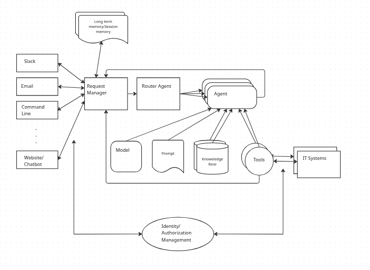

# Self-Service Agent Quickstart: Quick Start Guide

## 1. INTRODUCTION

### 1.1 Who Is This For?

This quick start guide is designed for:

- **IT teams** implementing AI-driven self-service solutions
- **DevOps engineers** deploying agent-based systems
- **Solution architects** evaluating AI automation platforms
- **Organizations** looking to streamline IT processes with generative AI

### 1.2 The Business Case for AI-Driven IT Self-Service

Many organizations are working to support IT processes through generative AI based self-service implementations. IT teams with Red Hat have already started on this journey and the team building this quickstart met with those teams to incorporate the lessons learned so far into the quickstart.

The key value propositions for implementing IT processes with generative AI include:

* **Reduced employee time to complete common requests.** The system helps employees create their requests by helping them understand the options and required information for the request and helps employees submit those requests once they are ready.
* **Higher compliance to process standards.** Requests will be more complete and aligned with process standards. This will reduce the need to contact the requesting employee for additional information and reduce time and effort to review and complete requests.
* **Fewer rejected requests due missing/incorrect information.** Rejected requests are frustrating for employees and leads to lower employee satisfaction. Avoiding request rejection and reducing back and forth on requests will improve employee satisfaction.
* **Shorter time to close a ticket.** The system helps tickets to close faster, improving throughput and reducing ticket idle time.

### 1.3 Example Use Cases

IT processes that are suitable for automation with generative AI include:

* Laptop refresh requests
* Privacy Impact Assessment (PIA) assessment
* RFP generation
* Access request processing
* Software license requests
* Equipment provisioning

### 1.4 What This Quickstart Provides

This quickstart provides the framework, components and knowledge to accelerate your journey to deploying generative AI based self-service implementations. Many AI based IT process implementations should be able to share common components within an enterprise. The addition of an Agent configuration file, along with additional tools, knowledge bases and evaluations complete the implementation for a specific use case. Often no code changes to the common components will be required to add additional tools, knowledge bases or agents.

### 1.5 What You'll Build

The quick start provides implementations of the common components along with the process specific pieces needed to support the laptop refresh IT process as a concrete implementation.

**Time to complete:** 30-60 minutes (depending on deployment mode)

By the end of this quickstart, you will have:
- A fully functional AI agent system deployed
- A working laptop refresh agent with knowledge bases and tools
- Completed evaluation runs demonstrating agent quality
- (Optional) Slack integration for real-world testing
- Understanding of how to customize for your own use cases

### 1.6 Architecture Overview

The self-service agent quickstart provides a reusable platform for building AI-driven IT processes:

In addition to the base components, the quickstart includes an evaluation framework and integration with OpenTelemetry support in OpenShift for observability.

**Why Evaluation Matters:**

Generative AI agents are non-deterministic by nature, meaning their responses can vary across conversations even with identical inputs. This makes traditional software testing approaches insufficient. The evaluation framework addresses this challenge by providing comprehensive validation capabilities that are crucial for successfully developing and iterating on agentic IT process implementations. The framework validates business-specific requirements—such as policy compliance and information gathering—ensuring agents meet quality standards before deployment and catch regressions during updates.

**Why Observability Matters:**

Agentic systems involve complex interactions between multiple components—routing agents, specialist agents, knowledge bases, MCP servers, and external systems—making production debugging challenging without proper visibility. The OpenTelemetry integration provides distributed tracing across the entire request lifecycle, enabling teams to understand how requests flow through the system, identify performance bottlenecks, and diagnose issues in production. This visibility is essential for tracking LLM token usage and costs, monitoring agent handoffs between routing and specialist agents, debugging failed external system integrations, and understanding user interaction patterns. By integrating with OpenShift's observability stack, teams gain unified monitoring across all platform components alongside their existing infrastructure metrics.

**Key Request Flow:**
1. User initiates request through any communications channel (Slack, Email, API, Web)
2. Request Manager validates and routes router agent
3. Router agent interacts with the user to find out what the user needs 
4. Router agent hands session off to specialist agent to complete the request
5. Specialist agent interacts with user to complete request using available knowledge bases and mcp servers

### 1.7 Laptop Refresh Implementation

The laptop refresh use case is implemented by adding the following specific components:

1. MCP server integrated with ServiceNow that can:
   * provide existing laptop information for an employee
   * submit a refresh request 
2. Laptop refresh knowledge base that includes laptop refresh policy and available
   laptop options per region
3. Router agent that knows how to route to the Laptop refresh agent
4. Laptop refresh agent configured with prompts for the refresh process
5. A set of evaluations specific to the laptop refresh IT process

**User Authentication:**

The user's email address is used as the authoritative identifier for the user. Communication channels like Slack and email provide pre-authenticated user identities, eliminating the need for separate authentication. The email address obtained from these channels is passed through the Request Manager to MCP servers, which use it to perform operations on behalf of the user—such as retrieving employee information and submitting refresh requests.

The ServiceNow MCP server authenticates to the ServiceNow backend using a service account, following standard ServiceNow integration patterns.

**Example Conversation: Laptop Refresh Process**

**User:** Hi, I'm looking to refresh my laptop, can you please guide me through the process and show me the available options?

**Agent:** Your laptop, an EliteBook 840 G7, was purchased on 2019-05-12 and is currently 6 years and 5 months old. The company's laptop refresh policy states that standard laptops will be refreshed every 3 years from the date of issuance. Since your laptop is older than 3 years, you are eligible for a laptop refresh. Would you like to proceed with reviewing the available laptop options for your location?

**User:** Yes, I'd like to proceed with reviewing the available laptop options for my location.

**Agent:** Here are the available laptop options for your location (NA):

**1. Apple MacBook Air M3** (Code: apple_mac_book_air_m_3)
- Target User: General Office
- Cost: $1,199 USD
- Operating System: macOS
- Display: 13.6" (2560 x 1664)
- Processor: Apple M3
- Memory: 8 GB
- Storage: 256 GB SSD
- Weight: 2.7 lbs

**2. Apple MacBook Pro 14 M3 Pro** (Code: apple_mac_book_pro_14_m_3_pro)
- Target User: Developers
- Cost: $1,999 USD
- Operating System: macOS
- Display: 14.2" (3024 x 1964)
- Processor: Apple M3 Pro
- Memory: 18 GB
- Storage: 512 GB SSD
- Weight: 3.5 lbs

**3. Lenovo ThinkPad T14 Gen 5 Intel** (Code: lenovo_think_pad_t_14_gen_5_intel)
- Target User: General Office
- Cost: $1,399 USD
- Operating System: Windows 11 Pro
- Display: 14" (1920 x 1200)
- Processor: Intel Core i7-1555U
- Memory: 16 GB
- Storage: 512 GB SSD
- Weight: 3.2 lbs

**4. Lenovo ThinkPad P1 Gen 7** (Code: lenovo_think_pad_p_1_gen_7)
- Target User: Engineers
- Cost: $2,499 USD
- Operating System: Red Hat Linux
- Display: 16" (2560 x 1600)
- Processor: Intel Core i7-13800H
- Memory: 32 GB
- Storage: 1 TB SSD
- Graphics: NVIDIA RTX A1000
- Weight: 4.1 lbs

Please select one of the above options. Remember to consider your job role and requirements when making your selection.

**User:** I'd like to select option 1, the Apple MacBook Air M3, as it seems suitable for my general office needs.

**Agent:** You've selected the Apple MacBook Air M3. Would you like to proceed with the creation of a ServiceNow ticket for a laptop refresh?

**User:** Yes, please proceed with creating the ServiceNow ticket for the laptop refresh, and can you also let me know what information I need to provide for the ticket?

**Agent:** A ServiceNow ticket for a laptop refresh has been created for you. The ticket number is REQ3143724. Your request will be processed by the IT Hardware Team, and you will receive updates via email as the ticket progresses.

Is there anything else I can help you with?

### 1.8 Customizing for Your Use Case

To adapt this quickstart for your specific IT process:

- Replace laptop refresh agent with your specialist agent (e.g., PIA, RFP)
- Update the router agent to be able to route to your new specialist agent
- Add MCP servers for your external systems
- Create knowledge base with your policies and documentation
- Build evaluation suite for your business metrics

---

## What's Next

Now that you understand the architecture and capabilities of the self-service agent quickstart, the next section will guide you through the prerequisites and setup steps needed to deploy the system on your OpenShift cluster.
