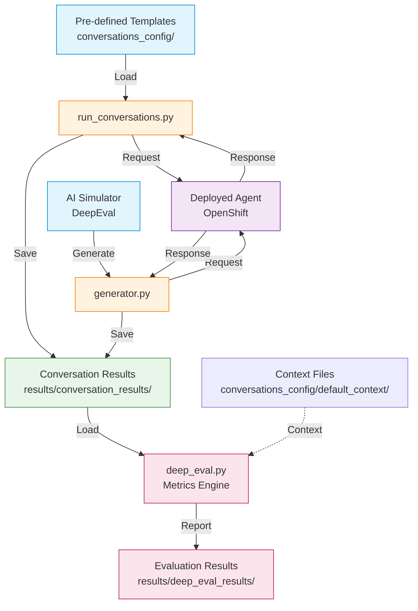

# Conversation Evaluation Guide

## 1. Overview

### 1.1 What is the Evaluation Framework?

Evaluations are important to be able to build and deploy agentic systems. Agentic systems are probabilistic, meaning that while each conversation may be unique for the same user input, multiple different responses can all be "correct". This makes testing and evaluation more difficult.

At the same time, sensitivity to change in agentic systems makes it vital that we can automatically validate behaviour after making changes to the system as small changes can easily introduce subtle issues that are difficult to manually identify. Traditional unit testing approaches are insufficient for these systems - they require evaluation frameworks that can assess quality and correctness across multiple valid outcomes.

This quickstart includes an evaluation framework built on top of [DeepEval](https://github.com/confident-ai/deepeval). This framework was a crucial tool in the development of the quickstart and provides an example of the kind of evaluation framework you will need as you build your agentic systems.

It allowed us to include validation as part of PR CI testing, compare performance of different models, evaluate changes to prompts and identify and address common conversation failures.

**Key Capabilities**

The framework provides three main capabilities:

1. **Live Agent Testing**: Execute predefined conversation flows against deployed agents in OpenShift, capturing real responses and interactions
2. **Synthetic Conversation Generation**: Use AI to generate realistic test conversations at scale, simulating diverse user behaviors and scenarios
3. **Comprehensive Metrics Evaluation**: Apply both standard conversational metrics and domain-specific business metrics to assess agent performance

**Three Types of Test Conversations**

The framework supports three distinct types of test conversations, each serving a different testing purpose:

- **Pre-defined conversations**: Hand-crafted test cases that validate critical user flows
- **Generated conversations**: AI-generated scenarios that provide broad test coverage
- **Known bad conversations**: Expected failure cases that validate the evaluation system itself

### 1.2 Architecture

The evaluation framework consists of four main components that work together in a coordinated pipeline:

**Four-Component Pipeline**

1. **`evaluate.py`** - Pipeline Orchestrator
   - Coordinates execution of all evaluation steps
   - Manages cleanup of previous test runs
   - Aggregates results and token usage statistics
   - Provides unified command-line interface
   - Handles error recovery and reporting

2. **`run_conversations.py`** - Live Agent Testing with Pre-defined Inputs
   - Executes pre-defined conversation templates against deployed agent
   - Uses hand-crafted user inputs from conversation templates
   - Connects to deployed agents via OpenShift
   - Captures real agent responses
   - Saves complete conversation transcripts
   - Tracks token usage from agent interactions

3. **`generator.py`** - Live Agent Testing with AI-Generated Inputs
   - Tests deployed agent with AI-generated user inputs
   - Simulates realistic user behaviors and diverse scenarios
   - Uses DeepEval's conversation simulator to generate user messages
   - Sends generated inputs to actual deployed agent
   - Captures real agent responses for each simulated user turn
   - Creates conversations with configurable length and complexity
   - Produces timestamped conversation files

4. **`deep_eval.py`** - Metrics-Based Evaluation
   - Applies comprehensive evaluation metrics to conversations
   - Uses LLM-based assessment for nuanced quality checks
   - Generates individual and aggregate evaluation reports
   - Provides detailed pass/fail analysis with scoring
   - Supports both standard and custom metrics

**How Components Work Together**

The typical evaluation workflow follows this sequence:

```
1. evaluate.py (Orchestrator)
   ↓
2. Cleanup Phase
   - Remove previous generated conversations
   - Clear old token usage files
   ↓
3. run_conversations.py
   - Execute pre-defined conversation templates
   - Save results to results/conversation_results/
   ↓
4. generator.py
   - Generate synthetic conversations
   - Add to results/conversation_results/
   ↓
5. deep_eval.py
   - Evaluate ALL conversations (pre-defined + generated)
   - Apply comprehensive metrics
   - Generate reports in results/deep_eval_results/
   ↓
6. Results Aggregation
   - Combine token usage statistics
   - Generate summary reports
   - Calculate overall pass rates
```

**Data Flow Diagram**



### 1.3 Prerequisites

Before using the evaluation framework, ensure you have the following prerequisites in place:

**Python 3.12+ Requirements**

The evaluation framework requires Python 3.12 or higher. It uses modern Python features and type hints that are not available in earlier versions.

```bash
# Check Python version
python --version  # Should show Python 3.12.x or higher

# Or with python3
python3 --version
```

**OpenShift CLI and Authentication**

The framework executes conversations against agents deployed in OpenShift. You'll need:

1. **OpenShift CLI (`oc`)**: Install the OpenShift command-line tool
   ```bash
   # Verify installation
   oc version
   ```

2. **Cluster Authentication**: Log in to your OpenShift cluster
   ```bash
   oc login --server=https://your-cluster:6443 --token=your-token
   ```

3. **Namespace Access**: Ensure you have access to the namespace where the agent is deployed
   ```bash
   # Verify access
   oc get pods -n your-namespace
   ```

**Deployed Self-Service Agent**

The evaluation framework requires a running instance of the self-service agent in OpenShift:

- Agent must be accessible via `oc exec` commands
- Agent should have the test script available (default: `chat.py`)
- Agent pods must be in Running state
- Agent should be able to process conversation requests

**LLM API Access**

The framework requires access to an LLM API for two purposes:

1. **Conversation Generation**: Simulating realistic user behavior (uses `generator.py`)
2. **Evaluation Metrics**: Assessing conversation quality with LLM-based metrics (uses `deep_eval.py`)

Supported API types:
- OpenAI-compatible endpoints

**Environment Variables Needed**

Configure the following environment variables before running evaluations:

**Required:**

```bash
# LLM API authentication token
export LLM_API_TOKEN="your-api-key-here"

# LLM API endpoint URL
export LLM_URL="https://your-llm-endpoint.com/v1"
```

**Optional:**

```bash
# Specific model ID to use (if not using endpoint default)
export LLM_ID="llama-3-3-70b-instruct"
```

**Verification:**

Verify your environment is properly configured:

```bash
# Check environment variables
echo $LLM_API_TOKEN  # Should show your API key
echo $LLM_URL        # Should show your endpoint URL

# Check OpenShift access
oc whoami           # Should show your username
oc project          # Should show current project/namespace

# Check Python version
python --version    # Should be 3.12 or higher
```

### 1.4 Types of Test Conversations

The evaluation framework supports three distinct types of test conversations, each serving a specific purpose in the testing strategy:

#### Pre-defined Conversations

**Location**: `conversations_config/conversations/`

Pre-defined conversations are hand-crafted test cases that validate critical user flows and scenarios. These conversations are version-controlled JSON files that represent important paths through your agent's functionality.

**Characteristics:**

- **Curated scenarios**: Carefully designed to test specific agent capabilities
- **Consistent baseline**: Same conversations run every time for regression testing
- **Version controlled**: Tracked in git for change management
- **Deterministic**: Produce repeatable results for comparison across runs
- **Human-verified**: Created by developers/QA who understand business requirements

**Example Structure:**

```json
{
    "metadata": {
        "authoritative_user_id": "alice.johnson@company.com",
        "description": "Successful laptop refresh flow"
    },
    "conversation": [
        {"role": "user", "content": "refresh"},
        {"role": "user", "content": "1001"},
        {"role": "user", "content": "I would like to see the options"},
        {"role": "user", "content": "3"},
        {"role": "user", "content": "proceed"}
    ]
}
```

**Special Subdirectory:**

- `conversations_config/conversations/no-employee-id/`: Alternative conversation templates for testing agents that don't require employee ID collection (uses authenticated user identity instead)

#### Generated Conversations

**Location**: Created in `results/conversation_results/` with prefix `generated_flow_`

Generated conversations are synthetic test cases created automatically by the `generator.py` script using DeepEval's conversation simulator. These conversations simulate realistic user behavior at scale.

**Characteristics:**

- **AI-generated**: Created using LLM to simulate realistic user responses
- **Scalable coverage**: Generate 10s or 100s of conversations in a single run
- **Realistic variation**: Different user behaviors, phrasings, and interaction patterns
- **Diverse scenarios**: Covers scenarios that manual testers might not think of
- **Timestamped**: Each generation creates unique files with timestamps

**How It Works:**

1. `generator.py` uses a DeepEval `ConversationSimulator`
2. Simulator uses an LLM to generate user messages based on scenario
3. Each user message is sent to the actual deployed agent
4. Agent responses are captured in the conversation
5. Process continues until conversation completes or max turns reached

**Example Generation:**

```bash
# Generate 20 conversations with up to 30 turns each
python generator.py 20 --max-turns 30

# Results in files like:
# - generated_flow_1_20251009_143521.json
# - generated_flow_2_20251009_143612.json
# - generated_flow_3_20251009_143705.json
```

**Customization:**

You can customize generated conversations by modifying:
- Scenario descriptions (what situation the user is in)
- User descriptions (employee ID, behavior characteristics)
- Maximum turns (conversation length)
- Random seed (for reproducible generation)

#### Known Bad Conversations

**Location**: `results/known_bad_conversation_results/`

Known bad conversations are test cases that are expected to fail evaluation metrics. These represent problematic agent behaviors that have been identified and documented.

**Characteristics:**

- **Regression test suite**: Ensures previously identified issues are detected
- **Expected failures**: Pass when metrics correctly identify problems

**Testing Known Bad Conversations:**

```bash
# Run evaluation on known bad conversations
python evaluate.py --check

# Expected behavior:
# - Evaluations run successfully
# - Metrics correctly identify failures
# - Exit code indicates problems were detected
```

**Exit Codes:**

- Exit code 0: Known bad conversations failed as expected (GOOD)
- Exit code 1: Known bad conversations passed unexpectedly (BAD - metrics aren't working)

**Creating Known Bad Conversations:**

When you find a problematic conversation:

1. Save the conversation file to `results/known_bad_conversation_results/`
2. Document what's wrong in the filename or metadata
3. Run `python evaluate.py --check` to verify metrics detect the issue
4. Use as regression test to prevent similar issues

**Example:**

```json
{
    "metadata": {
        "authoritative_user_id": "test.user@company.com",
        "description": "Agent returns wrong ticket format - should fail"
    },
    "conversation": [
        {"role": "user", "content": "I need a new laptop"},
        {"role": "assistant", "content": "I've created ticket INC0123456 for you"},
        {"role": "assistant", "content": "DONEDONEDONE"}
    ]
}
```

This conversation should fail the "Ticket number validation" metric because the ticket starts with "INC" instead of "REQ".

## 2. Quick Start

This section will guide you through installing the evaluation framework, configuring your environment, and running your first evaluation.

### 2.1 Installation

The evaluation framework uses **uv** for dependency management, which provides fast, reliable Python package installation and virtual environment management.

**Install with UV**

```bash
# Navigate to the evaluations directory
cd evaluations/

# Install dependencies using uv
# Note: uv automatically creates a .venv directory if it doesn't exist
uv sync
```

**What Gets Installed**

The `uv sync` command installs:

**Core dependencies:**
- `deepeval>=3.3.9` - Evaluation framework for conversational AI
- `openai>=1.99.0` - LLM API client library

**Verify Installation**

After installation, verify that everything is set up correctly:

```bash
# Activate the uv environment
source .venv/bin/activate  # On Linux/Mac
# or
.venv\Scripts\activate  # On Windows

# Check Python version
python --version  # Should be 3.12 or higher

# Verify deepeval is installed
python -c "import deepeval; print(deepeval.__version__)"

# Verify OpenAI client is installed
python -c "import openai; print(openai.__version__)"
```

### 2.2 Environment Configuration

Before running evaluations, you need to configure environment variables for LLM API access and verify your OpenShift connection.

**Required Environment Variables**

Set these environment variables in your shell:

```bash
# LLM API authentication token
export LLM_API_TOKEN="your-api-key-here"

# LLM API endpoint URL (OpenAI-compatible)
export LLM_URL="https://your-llm-endpoint.com/v1"
```

**Optional Environment Variables**

```bash
# Specific model ID to use (if not using endpoint default)
export LLM_ID="llama-3-3-70b-instruct"
```

**OpenShift Connection Setup**

The evaluation framework executes conversations against agents deployed in OpenShift. Ensure you have:

1. **OpenShift CLI installed**:
   ```bash
   # Verify oc is installed
   oc version
   ```

2. **Logged into your cluster**:
   ```bash
   # Log in to your OpenShift cluster
   oc login --server=https://your-cluster:6443 --token=your-token
   ```

3. **Access to the correct namespace**:
   ```bash
   # Switch to the namespace where your agent is deployed
   oc project your-namespace

   # Verify you can see the agent pods
   oc get pods | grep agent
   ```

**Verification Steps**

Run these commands to verify your environment is properly configured:

```bash
# 1. Check environment variables
echo $LLM_API_TOKEN  # Should display your API key
echo $LLM_URL        # Should display your endpoint URL

# 2. Check OpenShift access
oc whoami           # Should show your username
oc project          # Should show current namespace

# 3. Check Python and dependencies
python --version    # Should be 3.12 or higher
python -c "import deepeval, openai"  # Should run without errors

# 4. Verify agent pods are running
oc get pods         # Should show agent pods in Running state
```

### 2.3 Running Your First Evaluation

Once installation and configuration are complete, you're ready to run your first evaluation using the orchestrator script.

**Basic Pipeline Execution**

The `evaluate.py` script orchestrates the complete evaluation pipeline:

```bash
# Run the complete evaluation pipeline with default settings
# - Executes predefined conversation templates
# - Generates 20 additional synthetic conversations
# - Evaluates all conversations with comprehensive metrics
python evaluate.py
```

**Common Command-Line Options**

```bash
# Generate fewer conversations (faster for testing)
python evaluate.py -n 5

# Generate more conversations (broader coverage)
python evaluate.py --num-conversations 50

# Adjust maximum conversation turns
python evaluate.py --max-turns 30

# Use a different test script in OpenShift
python evaluate.py --test-script my_agent.py

# Skip employee ID collection checks
python evaluate.py --no-employee-id

# Test known bad conversations (validation check)
python evaluate.py --check
```

**Understanding the Output**

When you run the evaluation pipeline, you'll see output organized by steps:

```
🎯 Starting Evaluation Pipeline
================================================================================
📋 Step 1/3: Running predefined conversation flows...
🚀 Starting: python run_conversations.py --test-script chat.py
   [Output from conversation execution...]
✅ Completed: run_conversations.py (Duration: 45.32s)

📋 Step 2/3: Generating 20 additional test conversations...
🚀 Starting: python generator.py 20 --max-turns 20 --test-script chat.py
   [Output from conversation generation...]
✅ Completed: generator.py (Duration: 180.45s)

📋 Step 3/3: Running deepeval evaluation...
🚀 Starting: python deep_eval.py
   [Output from evaluation...]
✅ Completed: deep_eval.py (Duration: 95.12s)

🏁 Evaluation Pipeline Complete (Total Duration: 199.75s)
```

After the pipeline completes, you'll first see the evaluation results summary:

```
================================================================================
🏆 DEEPEVAL CONVERSATION EVALUATION RESULTS
================================================================================
📊 OVERVIEW:
   • Total conversations evaluated: 3
   • Successful evaluations: 3
   • Failed evaluations: 0
   • Success rate: 100.0%
   • Overall metric pass rate: 39/39 (100.0%)
   • Individual metric performance:
     ✅ Turn Relevancy: 3/3 (100.0%)
     ✅ Role Adherence: 3/3 (100.0%)
     ✅ Conversation Completeness: 3/3 (100.0%)
     ✅ Information Gathering [Conversational GEval]: 3/3 (100.0%)
     ✅ Policy Compliance [Conversational GEval]: 3/3 (100.0%)
     ✅ Option Presentation [Conversational GEval]: 3/3 (100.0%)
     ✅ Process Completion [Conversational GEval]: 3/3 (100.0%)
     ✅ User Experience [Conversational GEval]: 3/3 (100.0%)
     ✅ Flow termination [Conversational GEval]: 3/3 (100.0%)
     ✅ Ticket number validation [Conversational GEval]: 3/3 (100.0%)
     ✅ Correct eligibility validation [Conversational GEval]: 3/3 (100.0%)
     ✅ No errors reported by agent [Conversational GEval]: 3/3 (100.0%)
     ✅ Correct laptop options for user location [Conversational GEval]: 3/3 (100.0%)
   • Status: ✅ ALL EVALUATIONS PASSED

──────────────────────────────────────────────────

🏁 CONVERSATION SUMMARY:
   ✅ success-flow-1.json: 13/13 metrics passed
   ✅ known_good_flow.json: 13/13 metrics passed
   ✅ generated_flow_1_20251010_171328.json: 13/13 metrics passed

🎉 OVERALL RESULT: ALL CONVERSATIONS PASSED
================================================================================
```

Following the evaluation results, you'll see a comprehensive token usage summary:

```
================================================================================
=== COMPLETE PIPELINE TOKEN USAGE SUMMARY ===
================================================================================

📱 App Tokens (from chat agents):
  Input tokens: 27,053
  Output tokens: 2,290
  Total tokens: 29,343
  API calls: 12

🔬 Evaluation Tokens (from evaluation LLM calls):
  Input tokens: 104,126
  Output tokens: 4,388
  Total tokens: 108,514
  API calls: 73

📊 Combined Pipeline Statistics:
  Total LLM calls: 85
  Total input tokens: 131,179
  Total output tokens: 6,678
  Total tokens used: 137,857
  Average per call: 1543.3 input, 78.6 output, 1621.8 total

📈 Maximum Tokens by Script Type:
  Run Conversations:
    Total calls: 6
    Total tokens: 14,738
  Generator:
    Total calls: 15
    Total tokens: 25,110
  Deep Eval:
    Total calls: 64
    Total tokens: 98,009
================================================================================
```

These summaries show:
- **Evaluation results**: Overall pass/fail rates and per-metric performance
- **Token usage**: Detailed breakdown of LLM API usage for cost tracking
- **Script breakdown**: Token usage by each pipeline component

**Where to Find Results**

The evaluation pipeline creates results in the `results/` directory:

```
results/
├── conversation_results/          # Conversation transcripts
│   ├── success-flow-1.json       # From predefined templates
│   ├── known_good_flow.json      # From predefined templates
│   ├── generated_flow_1_*.json   # AI-generated conversations
│   ├── generated_flow_2_*.json
│   └── ...
├── deep_eval_results/            # Evaluation reports
│   ├── deepeval_success-flow-1.json        # Individual results
│   ├── deepeval_generated_flow_1_*.json
│   ├── deepeval_all_results.json           # Combined results
│   └── ...
└── token_usage/                  # Token usage statistics
    ├── run_conversations_*.json
    ├── generator_*.json
    ├── deep_eval_*.json
    └── pipeline_aggregated_*.json  # Combined token stats
```

**Examining Results**

If there are failures you may want to look at the details for a specific
conversation. The following files are available for you to do that:

1. **Conversation transcripts** (`results/conversation_results/`):
   - View actual conversations between users and the agent
   - See user inputs and agent responses

2. **Evaluation reports** (`results/deep_eval_results/`):
   - Individual JSON files show metric-by-metric evaluation
   - `deepeval_all_results.json` provides aggregated pass/fail statistics
   - Each metric includes score, success status, and reason

3. **Token usage** (`results/token_usage/`):
   - Track LLM API usage for cost estimation
   - Separate app tokens (agent) from evaluation tokens
   - Identify expensive conversations or metrics

**Example: Viewing Evaluation Results**

```bash
# View the combined evaluation results
cat results/deep_eval_results/deepeval_all_results.json | jq .

# Count successful evaluations
cat results/deep_eval_results/deepeval_all_results.json | jq '.successful_evaluations | length'

# View a specific conversation result
cat results/conversation_results/success-flow-1.json | jq .

# Check token usage summary
cat results/token_usage/pipeline_aggregated_*.json | jq '.summary'
```

## 3. Creating Conversation Templates

Conversation templates are hand-crafted test cases that define specific user flows to test your agent. This section explains how to create and organize conversation templates for systematic testing.

### 3.1 Template Format

Conversation templates are JSON files with a simple, standardized structure that defines metadata and the conversation flow.

**Basic Structure**

Every conversation template consists of two main sections:

```json
{
    "metadata": {
        "authoritative_user_id": "alice.johnson@company.com",
        "description": "Brief description of what this conversation tests"
    },
    "conversation": [
        {"role": "user", "content": "User's first message"},
        {"role": "user", "content": "User's second message"},
        {"role": "user", "content": "User's third message"}
    ]
}
```

**Template Components**

1. **metadata** (object):
   - `authoritative_user_id` (required): The user identity to use for this conversation
     - Must be an email address (e.g., `alice.johnson@company.com`)
     - Must match an entry in the `authoritative_user_ids` file
   - `description` (required): Human-readable description of the test scenario
     - Explains what user flow or edge case this template tests
     - Useful for understanding test failures

2. **conversation** (array):
   - Array of conversation turns
   - Each turn is an object with:
     - `role`: Always `"user"` (only user messages are predefined)
     - `content`: The exact text the user will send
   - Agent responses are captured dynamically during execution
   - Order matters - messages are sent sequentially

**Field Requirements**

```json
{
    "metadata": {
        "authoritative_user_id": "required - string - user identity",
        "description": "required - string - test scenario description"
    },
    "conversation": [
        {
            "role": "required - always 'user'",
            "content": "required - string - user message text"
        }
    ]
}
```

### 3.2 Predefined Conversations

Predefined conversations are stored in specific directories and follow naming conventions that make them easy to identify and manage.

**Location and Directory Structure**

```
evaluations/
└── conversations_config/
    └── conversations/
        ├── success-flow-1.json             # Standard flow
        ├── edge-case-ineligible.json       # Edge case
        └── error-handling.json             # Error scenario
```

**Creating a New Template**

To create a new conversation template:

1. **Choose a descriptive filename**:
   ```bash
   # Good names describe the scenario being tested
   success-flow-1.json
   laptop-refresh-eligible-user.json
   ineligible-user-too-recent.json
   ```

2. **Create the JSON file** in `conversations_config/conversations/`:
   ```json
   {
       "metadata": {
           "authoritative_user_id": "john.doe@company.com",
           "description": "User requests laptop refresh and completes full flow"
       },
       "conversation": [
           {"role": "user", "content": "I need a new laptop"},
           {"role": "user", "content": "1005"},
           {"role": "user", "content": "show me the options"},
           {"role": "user", "content": "2"},
           {"role": "user", "content": "yes, proceed"}
       ]
   }
   ```

3. **Ensure the user ID exists** in `authoritative_user_ids`

The MCP servers used to look up employee laptop information only
have information for the users specified in the `authoritative_user_ids` file
so all conversations must specify one of these users

### 3.3 User IDs and Authentication

The evaluation framework uses authoritative user IDs to simulate different users during testing. These IDs are managed through a simple text file.

**Authoritative User IDs File**

The `authoritative_user_ids` file contains a list of valid user email addresses that can be used in conversation templates:

**Location**: `conversations_config/authoritative_user_ids`

**Format**: Simple text file with one email address per line

```
alice.johnson@company.com
john.doe@company.com
maria.garcia@company.com
oliver.smith@company.com
yuki.tanaka@company.com
```

**How User IDs Are Selected**

When running conversations, the framework:

1. **Reads** the `authoritative_user_ids` file
2. **Matches** the `authoritative_user_id` from the template metadata
3. **Uses** that identity when communicating with the agent

**Example Template**

```json
{
    "metadata": {
        "authoritative_user_id": "alice.johnson@company.com",
        "description": "User requests laptop refresh"
    },
    "conversation": [
        {"role": "user", "content": "I need a new laptop"}
    ]
}
```

### 3.4 Known Bad Conversations

Known bad conversations are test cases that represent problematic agent behaviors. These conversations are expected to fail evaluation metrics and serve as regression tests to ensure your evaluation system correctly identifies issues.

**Location and Directory Structure**

Known bad conversations are stored separately from regular test conversations:

```
evaluations/
└── results/
    └── known_bad_conversation_results/
        ├── wrong-ticket-format.json
        ├── incomplete-flow.json
        ├── policy-violation.json
        └── error-not-handled.json
```

**Creating a Known Bad Conversation**

When you discover or want to document a problematic agent behavior:

1. **Create the conversation file** in `results/known_bad_conversation_results/`
2. **Use descriptive filenames** that indicate what's wrong (e.g., `wrong-ticket-format.json`)
3. **Document the issue** in the metadata description
4. **Include the problematic behavior** in the conversation turns

**Example: Wrong Ticket Format**

```json
{
    "metadata": {
        "authoritative_user_id": "test.user@company.com",
        "description": "Agent returns wrong ticket format - ticket should start with REQ not INC"
    },
    "conversation": [
        {"role": "user", "content": "I need a new laptop"},
        {"role": "assistant", "content": "I can help you with that request."},
        {"role": "user", "content": "yes, proceed"},
        {"role": "assistant", "content": "I've created ticket INC0123456 for you"},
        {"role": "assistant", "content": "Is there anything else I can help you with?"}
    ]
}
```

This conversation should fail the "Ticket number validation" metric because the ticket number starts with "INC" instead of "REQ".

**Testing Known Bad Conversations**

To verify your evaluation metrics correctly identify problems, use the `--check` flag:

```bash
# Run evaluation on known bad conversations
python evaluate.py --check
```

**Expected Behavior:**

When you run `--check`, the evaluation system should:

1. **Process** all conversation files in `results/known_bad_conversation_results/`
2. **Apply** all evaluation metrics to each conversation
3. **Identify** the problematic behaviors (metrics should fail)
4. **Report** which metrics detected issues
5. **Exit** with appropriate exit code

**Understanding Exit Codes:**

- **Exit code 0**: Known bad conversations failed as expected ✅ (GOOD - metrics are working)
- **Exit code 1**: Known bad conversations passed unexpectedly ❌ (BAD - metrics aren't detecting problems)

**Example Check Output:**

```bash
$ python evaluate.py --check

🔍 Starting Check of Known Bad Conversations
================================================================================
📁 Found 9 known bad conversation files to check
📊 Running deepeval on known bad conversations...

============================================================
RESULTS FOR: no-ticket-number.json
============================================================
📊 METRIC BREAKDOWN:
   ✅ PASS Turn Relevancy: 1.000 (threshold: 0.8)
   ✅ PASS Role Adherence: 1.000 (threshold: 0.5)
   ✅ PASS Conversation Completeness: 1.000 (threshold: 0.8)
   ...
   ❌ FAIL Ticket number validation [Conversational GEval]: 0.000 (threshold: 1.0)
      Reason: The conversation does not mention the ticket number, so it's impossible to verify...
   ❌ FAIL Employeed id requested [Conversational GEval]: 0.000 (threshold: 1.0)
      Reason: The conversation completely fails to meet the criteria because the assistant never asks...

   📈 PASS RATE: 12/14 (85.7%)

================================================================================
🔍 KNOWN BAD CONVERSATIONS CHECK RESULTS
================================================================================
📊 OVERVIEW:
   • Total known bad conversations: 9
   • Successfully evaluated: 9
   • LLM evaluation failures: 0
   • Overall metric pass rate: 97/126 (77.0%)

──────────────────────────────────────────────────

🏁 CONVERSATION RESULTS:
   ⚠️ missing-employee-id-prompt.json: 1/14 metrics failed (as expected: False)
      Failed metrics:
        • Employeed id requested [Conversational GEval] (score: 0.000) - ...
   ⚠️ incomplete.json: 4/14 metrics failed (as expected: False)
      Failed metrics:
        • Turn Relevancy (score: 0.750) - ...
        • Flow termination [Conversational GEval] (score: 0.000) - ...
   ❌ allowed_invalid_user-laptop-selection.json: 11/14 metrics failed (as expected: True)
      Failed metrics:
        • Turn Relevancy (score: 0.667) - ...
        • Role Adherence (score: 0.333) - ...
        [9 more failed metrics...]

──────────────────────────────────────────────────

📊 CONVERSATION SUMMARY:
   • Total conversations: 9
   • Passing conversations: 0
   • Failing conversations: 9

❌ FAILING CONVERSATIONS:
   • missing-employee-id-prompt.json: 1/14 metrics failed (7.1%)
   • not-all-laptop-options.json: 1/14 metrics failed (7.1%)
   • no-ticket-number.json: 2/14 metrics failed (14.3%)
   • incomplete.json: 4/14 metrics failed (28.6%)
   • wrong-selection.json: 6/14 metrics failed (42.9%)
   • allowed_invalid_user-laptop-selection.json: 11/14 metrics failed (78.6%)

🎉 OVERALL RESULT: 9/9 KNOWN BAD CONVERSATIONS FAILED AS EXPECTED
```

**Workflow for Adding Known Bad Conversations**

When you find a problematic conversation during testing:

1. **Copy the conversation file** from `results/conversation_results/` to `results/known_bad_conversation_results/`
2. **Rename the file** to describe the issue (e.g., `policy-violation-ineligible-user.json`)
3. **Update the description** in metadata to document what's wrong
4. **Run the check**:
   ```bash
   python evaluate.py --check
   ```
5. **Verify metrics detect the issue** - at least one metric should fail
6. **Commit to version control** to prevent regression

## 4. Running Conversations

The `run_conversations.py` script executes pre-defined conversation templates against your deployed agent. This section explains how to use the script, configure its behavior, and understand the results it produces.

### 4.1 Using run_conversations.py

The `run_conversations.py` script is the first step in the evaluation pipeline. It takes hand-crafted conversation templates and executes them against your live agent deployment in OpenShift.

**Basic Usage**

```bash
# Run with default settings
python run_conversations.py

# This will:
# 1. Load all templates from conversations_config/conversations/
# 2. Execute each conversation against the deployed agent
# 3. Save results to results/conversation_results/
# 4. Track and report token usage
```

**Command-Line Options**

The script supports several options to customize its behavior:

```bash
# Use a different test script in OpenShift
python run_conversations.py --test-script chat-responses-request-mgr.py

# Reset conversation state before each test
python run_conversations.py --reset-conversation

# Combine multiple options
python run_conversations.py --test-script my_agent.py --reset-conversation
```

**Option Details**

- `--test-script <name>`: Specifies which Python script to execute in the OpenShift pod
  - Default: `chat.py`
  - The script must be available in the `/app/test/` directory in the pod
  - Common alternatives: `chat-responses-request-mgr.py` for testing with request manager

- `--no-employee-id`: Uses alternative conversation files from the `no-employee-id` subdirectory
  - Useful for testing agents that use authenticated user identity instead of collecting employee IDs
  - Falls back to regular conversation files if no alternative exists

- `--reset-conversation`: Sends a "reset" message at the start of each conversation
  - Ensures each conversation starts with a fresh session
  - Useful for preventing state carryover between tests
  - The agent responds with a fresh introduction after reset

**Example Run**

```bash
$ python run_conversations.py --test-script chat.py --reset-conversation

INFO:helpers.run_conversation_flow:Found 2 JSON files to process
INFO:helpers.run_conversation_flow:Processing success-flow-1.json with 4 questions using authoritative_user_id: alice.johnson@company.com
INFO:helpers.openshift_chat_client:Sending reset message to start fresh conversation
INFO:helpers.openshift_chat_client:Reset response: Session cleared. Starting fresh!...
INFO:helpers.run_conversation_flow:Results saved to results/conversation_results/success-flow-1.json
INFO:helpers.run_conversation_flow:Processing known_good_flow.json with 5 questions...
INFO:helpers.run_conversation_flow:Results saved to results/conversation_results/known_good_flow.json
INFO:helpers.run_conversation_flow:Flows processing completed

=== Token Usage Summary ===

📱 App Tokens (from chat agent):
  Input tokens: 13,572
  Output tokens: 1,166
  Total tokens: 14,738
  API calls: 6
```

### 4.2 Understanding OpenShift Integration

The evaluation framework connects to your deployed agent via OpenShift's `oc exec` command. This provides a direct, interactive session with the agent.

**How OpenShift Sessions Work**

When you run a conversation, the framework:

1. **Establishes Connection**: Uses `oc exec` to create an interactive shell in the agent pod
2. **Sets Environment**: Configures `AUTHORITATIVE_USER_ID` to simulate the test user
3. **Starts Test Script**: Launches the specified test script (e.g., `chat.py`)
4. **Manages Session**: Maintains stdin/stdout pipes for message exchange
5. **Tracks Tokens**: Parses token usage information from agent responses
6. **Closes Session**: Gracefully terminates the connection when complete

**Session Management**

Each conversation creates a persistent session:

```python
# The framework maintains session state throughout the conversation
session.start_session()                    # Connect to OpenShift pod
intro = session.get_agent_initialization() # Get initial greeting
response = session.send_message("refresh") # Send user message
response = session.send_message("yes")     # Continue conversation
session.close_session()                    # Clean up
```

**OpenShift Prerequisites**

For the integration to work, ensure:

- `oc` command is installed and in your PATH
- You're logged into the correct OpenShift cluster (`oc login`)
- You're in the correct namespace (`oc project your-namespace`)
- Agent pods are running and accessible
- You have exec permissions on the deployment

**Connection Command**

The framework executes a command similar to:

```bash
oc exec -it deploy/self-service-agent -- bash -c \
  "AGENT_MESSAGE_TERMINATOR=:DONE AUTHORITATIVE_USER_ID=alice.johnson@company.com \
   /app/.venv/bin/python /app/test/chat.py"
```

This creates an interactive session where:
- `AGENT_MESSAGE_TERMINATOR=:DONE`: Marks the end of agent responses
- `AUTHORITATIVE_USER_ID=alice.johnson@company.com`: Sets the user identity
- `/app/.venv/bin/python /app/test/chat.py`: Runs the test script

**Token Tracking**

The framework automatically tracks token usage by parsing special output from the agent:

```
TOKEN_SUMMARY:INPUT:123:OUTPUT:456:TOTAL:579:CALLS:2:MAX_SINGLE_INPUT:50:MAX_SINGLE_OUTPUT:75:MAX_SINGLE_TOTAL:125
```

This provides:
- Total input/output tokens
- Number of LLM API calls
- Maximum tokens in a single request

### 4.3 Output Format

The script produces conversation result files in JSON format, saved to `results/conversation_results/`.

**Conversation Result Structure**

Each result file contains the complete conversation with both user and agent messages:

```json
{
  "metadata": {
    "authoritative_user_id": "alice.johnson@company.com",
    "description": "Test results from success-flow-1.json"
  },
  "conversation": [
    {
      "role": "assistant",
      "content": "Hello! I'm the routing agent..."
    },
    {
      "role": "user",
      "content": "refresh"
    },
    {
      "role": "assistant",
      "content": "Your laptop, a Latitude 7420, was purchased on 2020-01-15..."
    },
    {
      "role": "user",
      "content": "I would like to see the options"
    }
  ]
}
```

**Output Components**

1. **metadata**: Information about the test conversation
   - `authoritative_user_id`: The simulated user identity
   - `description`: Description of what the conversation tests

2. **conversation**: Array of conversation turns
   - Each turn has a `role` ("user" or "assistant") and `content` (message text)
   - Agent responses are captured from the live session
   - Complete conversation flow from start to finish

**Where Results Are Saved**

Results are written to:

```
results/conversation_results/
├── success-flow-1.json          # From template success-flow-1.json
├── edge-case-ineligible.json    # From template edge-case-ineligible.json
├── known_good_flow.json         # From template known_good_flow.json
└── ...
```

The output filename matches the input template filename. If a file already exists, it will be overwritten.

**Token Usage Files**

In addition to conversation results, the script saves token usage statistics:

```
results/token_usage/
└── run_conversations_20251010_171154.json
```

The token usage file contains:

```json
{
  "summary": {
    "total_input_tokens": 13572,
    "total_output_tokens": 1166,
    "total_tokens": 14738,
    "call_count": 6
  },
  "app_tokens": {
    "input": 13572,
    "output": 1166,
    "total": 14738,
    "calls": 6
  },
  "evaluation_tokens": {
    "total_input_tokens": 0,
    "total_output_tokens": 0,
    "total_tokens": 0,
    "call_count": 0
  }
}
```

**Reading Results**

To examine the conversation results:

```bash
# View a specific conversation
cat results/conversation_results/success-flow-1.json | jq .

# Count conversation turns
cat results/conversation_results/success-flow-1.json | jq '.conversation | length'

# Extract all user messages
cat results/conversation_results/success-flow-1.json | jq '.conversation[] | select(.role == "user") | .content'

# Extract all agent responses
cat results/conversation_results/success-flow-1.json | jq '.conversation[] | select(.role == "assistant") | .content'
```

## 5. Generating Synthetic Conversations

The `generator.py` script creates AI-generated test conversations by simulating realistic user behavior at scale. This section explains how synthetic conversation generation works and how to customize it for your testing needs.

### 5.1 Using generator.py

The `generator.py` script uses DeepEval's conversation simulator to generate realistic user messages and sends them to your deployed agent, capturing the actual agent responses. This creates diverse test coverage that would be difficult to achieve with manual test case creation.

**Basic Usage**

```bash
# Generate a single conversation (default)
python generator.py

# Generate multiple conversations
python generator.py 10

# Generate with specific maximum turns
python generator.py 5 --max-turns 25
```

**Command-Line Options**

The script supports several options to control generation behavior:

```bash
# Generate 20 conversations with default settings
python generator.py 20

# Limit conversation length to 15 turns
python generator.py 10 --max-turns 15

# Use a different test script in OpenShift
python generator.py 5 --test-script chat-responses-request-mgr.py

# Reset conversation state before each test
python generator.py 3 --reset-conversation

# Combine multiple options
python generator.py 10 --max-turns 20 --test-script chat.py --reset-conversation
```

**Option Details**

- **`num_conversations`** (positional argument):
  - Number of conversations to generate
  - Default: `1`
  - Example: `python generator.py 20` generates 20 conversations
  - Each conversation gets a unique user ID from `authoritative_user_ids`

- **`--max-turns <number>`**:
  - Maximum number of user simulation turns per conversation
  - Default: `30`
  - Controls conversation length (actual length may be shorter if agent ends conversation)
  - Higher values allow more thorough testing but increase generation time

- **`--test-script <name>`**:
  - Specifies which Python script to execute in the OpenShift pod
  - Default: `chat.py`
  - Same as `run_conversations.py` option
  - Must be available in `/app/test/` directory in the pod

- **`--reset-conversation`**:
  - Sends a "reset" message at the start of each conversation
  - Ensures fresh session state for each test
  - Prevents state carryover between conversations

**Example Run**

```bash
$ python generator.py 3 --max-turns 20

INFO:__main__:Starting conversation simulation with model: llama-3-3-70b-instruct
INFO:__main__:Generating 3 conversation(s) sequentially
INFO:__main__:Maximum user simulations per conversation: 20
INFO:__main__:Creating ConversationSimulator...
INFO:__main__:Generating conversation 1 of 3...
INFO:__main__:Conversation 1 using authoritative user ID: yuki.tanaka@company.com
INFO:__main__:Running simulation for conversation 1...
INFO:__main__:Conversation 1 simulation completed successfully
INFO:__main__:App tokens from conversation 1: {'input': 4521, 'output': 312, 'total': 4833, 'calls': 5}
INFO:__main__:Test case 1 saved to: results/conversation_results/generated_flow_1_20251010_143521.json

INFO:__main__:Generating conversation 2 of 3...
...

INFO:__main__:Sequential generation completed. Generated 3 total test cases

=== Saved Conversations ===
- results/conversation_results/generated_flow_1_20251010_143521.json
- results/conversation_results/generated_flow_2_20251010_143612.json
- results/conversation_results/generated_flow_3_20251010_143705.json

=== Token Usage Summary ===

📱 App Tokens (from chat agent):
  Input tokens: 13,456
  Output tokens: 945
  Total tokens: 14,401
  API calls: 15
```

### 5.2 How Conversation Generation Works

The conversation generation system combines AI-driven user simulation with live agent testing to create realistic test scenarios.

**Architecture Overview**

The generator uses a two-LLM architecture:

1. **User Simulator LLM**: Generates realistic user messages based on scenario
2. **Deployed Agent**: Provides actual agent responses via OpenShift

```
┌─────────────────────────────────────────────────────────────┐
│                    generator.py Process                      │
├─────────────────────────────────────────────────────────────┤
│                                                               │
│  ConversationSimulator (DeepEval)                            │
│  ├── Simulator LLM (User Behavior)                           │
│  │   └── Generates: "I need a laptop refresh"                │
│  │                                                            │
│  └── model_callback (OpenShift Client)                       │
│      └── Sends to: Deployed Agent → Get Real Response        │
│                                                               │
│  Repeat until: Conversation completes or max turns reached   │
└─────────────────────────────────────────────────────────────┘
```

**ConversationalGolden Objects**

`ConversationalGolden` objects are used to define the simulation scenario
(defined in generator.py):

```python
ConversationalGolden(
    scenario="An Employee wants to refresh their laptop. The agent shows them a "
             "list they can choose from, they select the appropriate laptop "
             "and a service now ticket number is returned.",
    expected_outcome="They get a Service now ticket number for their refresh request",
    user_description=f"authenticated user who tries to answer the assistants last question"
)
```

**Components:**

- **scenario**: Description of the user's goal and the expected interaction flow
  - Guides the simulator LLM to generate appropriate user messages
  - Should describe the complete user journey from start to finish
  - Can include specific behaviors.

- **expected_outcome**: What success looks like for this conversation
  - Helps the simulator understand when the conversation should conclude
  - Example: "They get a Service now ticket number"

- **user_description**: Characteristics of the simulated user
  - Defines user behavior (e.g., "tries to answer the assistants last question")
  - Can specify user personality, expertise level, or communication style

**model_callback Mechanism**

The `model_callback` function is the bridge between the simulator and your deployed agent:

```python
async def _model_callback(input: str, turns: List[Turn], thread_id: str) -> Turn:
    # 1. Receive user message from simulator
    logger.info(f"Sending to agent: {input}")

    # 2. Send to deployed agent via OpenShift
    response = client.send_message(input)

    # 3. Return agent's response to simulator
    logger.info(f"Agent response: '{response}'")
    return Turn(role="assistant", content=response)
```

**Flow:**

1. Simulator generates a user message
2. `model_callback` receives the message
3. Message is sent to deployed agent via OpenShift `oc exec`
4. Agent processes and responds
5. Response is returned to simulator
6. Simulator uses response to generate next user message
7. Process repeats until conversation completes or `max_turns` reached

### 5.3 Generated File Naming

Generated conversations are saved with timestamped filenames to ensure uniqueness and traceability.

**Filename Format**

Generated conversation files follow this naming pattern:

```
generated_flow_{number}_{timestamp}.json
```

Where:
- **`generated_flow_`**: Fixed prefix identifying generated conversations
- **`{number}`**: Sequential test case number (1, 2, 3, ...)
- **`{timestamp}`**: Generation timestamp in `YYYYMMDD_HHMMSS` format
- **`.json`**: File extension

**Examples:**

```
generated_flow_1_20251010_143521.json
generated_flow_2_20251010_143612.json
generated_flow_3_20251010_143705.json
```

**File Location**

All generated conversations are saved to:

```
results/conversation_results/generated_flow_*.json
```

This is the same directory where `run_conversations.py` saves predefined conversation results. This allows `deep_eval.py` to evaluate both types together.

The `evaluate.py` orchestrator automatically cleans up generated files before starting a new evaluation run.

**File Content Structure**

Generated conversation files use the same format as predefined conversations:

```json
{
  "metadata": {
    "authoritative_user_id": "yuki.tanaka@company.com",
    "description": "Generated conversation from deepeval simulation"
  },
  "conversation": [
    {
      "role": "user",
      "content": "Hi, I'm having some issues with my laptop and I think it needs a refresh."
    },
    {
      "role": "assistant",
      "content": "Your laptop, a XPS 13 9310, was purchased on 2018-09-03..."
    },
    {
      "role": "user",
      "content": "Yes, I'd like to review the available laptop options."
    }
  ]
}
```

The structure is identical to predefined conversations, making them fully compatible with the evaluation pipeline.

## 6. Evaluation Metrics

The evaluation framework uses a suite of metrics to assess conversation quality. This section explains what metrics measure, how they're scored, and how to create custom metrics for your specific needs.

### 6.1 Understanding DeepEval Metrics

The framework uses DeepEval's metric system to evaluate conversations through LLM-based assessment. This provides nuanced quality checks that go beyond simple pattern matching.

**How Metrics Work**

Each metric evaluates a conversation and returns:

1. **Score**: A numerical value (typically 0.0 to 1.0) indicating quality
2. **Success**: Boolean indicating whether the score meets the threshold
3. **Reason**: Detailed explanation of why the metric passed or failed

**Threshold Values**

Every metric has a threshold that determines pass/fail status:

- **Threshold 0.5**: Lenient - allows moderate quality (50% or better)
- **Threshold 0.8**: Standard - requires good quality (80% or better)
- **Threshold 1.0**: Strict - requires perfect quality (100%)

**LLM-Based Assessment**

Metrics use an LLM to evaluate conversations by:

1. Reading the entire conversation transcript
2. Analyzing content against evaluation criteria
3. Considering context (policies, laptop options, etc.)
4. Generating a score and detailed reasoning

This approach catches nuanced issues that rule-based systems would miss.

**Example Metric Output**

From an actual evaluation:

```
✅ PASS Turn Relevancy: 1.000 (threshold: 0.8)
❌ FAIL Ticket number validation [Conversational GEval]: 0.000 (threshold: 1.0)
   Reason: The conversation does not mention the ticket number, so it's impossible
   to verify if the first three characters are 'REQ' as required by the evaluation steps.
```

### 6.2 Standard Conversation Metrics

We use three built-in conversational metrics from DeepEval that assess fundamental conversation quality.

#### Turn Relevancy

**Purpose**: Measures whether each assistant response is relevant to the user's message and conversation context.

**Threshold**: 0.8 (requires 80% relevance across all turns)

**What It Checks**:
- Assistant responses address user questions
- Responses stay on topic
- No irrelevant or off-topic content
- Responses acknowledge user input appropriately

**Example Failure**:

```
❌ FAIL Turn Relevancy: 0.500 (threshold: 0.8)
   Reason: The score is 0.5 because the LLM incorrectly stated the user selected
   the 'Apple MacBook Air M2' in messages 3 and 4, when in fact the user had
   selected 'option 3, the Lenovo ThinkPad T14 Gen 4 Intel', indicating a
   significant mistake in the LLM's understanding of the user's selection.
```

This metric caught the agent misunderstanding the user's laptop selection.

#### Role Adherence

**Purpose**: Evaluates whether the assistant maintains its defined role throughout the conversation.

**Threshold**: 0.5 (requires 50% role consistency)

**Chatbot Role** (from `deep_eval.py:197`):
```
"You are an IT Support Agent specializing in hardware replacement. Your task is
to determine if an employee's laptop is eligible for replacement based on the
company policy and the specific context of their request."
```

**What It Checks**:
- Maintains IT Support Agent persona
- Doesn't claim to be the user or other roles
- Provides appropriate IT support guidance
- Follows professional support protocols

**Example Failure**:

```
❌ FAIL Role Adherence: 0.333 (threshold: 0.5)
   Reason: The score is 0.33 because the LLM chatbot responses failed to adhere
   to the IT Support Agent role, particularly in turn #5 where the chatbot said
   'I'd like to select option 5, the commodore 64, as it seems suitable for my
   role as a general office user.' This response is out of character as it appears
   to be a user's response rather than the IT Support Agent's.
```

This metric detected the agent accidentally speaking as the user instead of maintaining its support role.

#### Conversation Completeness

**Purpose**: Assesses whether the conversation reaches a satisfactory conclusion that fulfills the user's intent.

**Threshold**: 0.8 (requires 80% completeness)

**What It Checks**:
- User's initial intent is addressed
- Conversation has proper ending
- No abrupt terminations
- User's needs are satisfied

**Example Failure**:

```
❌ FAIL Conversation Completeness: 0.000 (threshold: 0.8)
   Reason: The score is 0.0 because the LLM response failed to address the user's
   invalid selection of 'option 5, the commodore 64', which is not one of the
   provided options, and instead proceeded to create a ServiceNow ticket without
   resolving the issue, thereby not fully satisfying the user's intention.
```

This metric identified an incomplete conversation where the agent didn't properly handle an invalid user selection.

### 6.3 Laptop Refresh-Specific Metrics

For the laptop refresh use case we defined custom ConversationalGEval metrics designed specifically for laptop refresh conversations. These metrics check the domain-specific business requirements. These metrics are defined in `get_deepeval_metrics.py`

#### Information Gathering

**Purpose**: Evaluates whether the assistant collects necessary information to process the laptop refresh request.

**Threshold**: 0.8

**Evaluation Steps**:
```python
evaluation_steps=[
    "Evaluate if the assistant gathers necessary information about the user's current laptop.",
    "Check if the assistant follows a logical flow for information collection.",
    "Assess if the assistant properly requests employee ID from the user."  # Conditional
]
```

**What It Checks**:
- Gathers current laptop information
- Follows logical information collection sequence
- Requests employee ID (when `--no-employee-id` is not set)

#### Policy Compliance

**Purpose**: Verifies the assistant correctly applies laptop refresh policies.

**Threshold**: 0.8

**Evaluation Steps**:
```python
evaluation_steps=[
    "Assess if the assistant correctly applies laptop refresh policies.",
    "Evaluate if eligibility determination is accurate based on laptop age and warranty.",
    "Check if the assistant provides clear policy explanations.",
]
```

**What It Checks**:
- Applies refresh policy timeline correctly
- Determines eligibility based on laptop age
- Explains policy to users clearly

**Example Failure**:

```
❌ FAIL Policy Compliance [Conversational GEval]: 0.000 (threshold: 0.8)
   Reason: The conversation completely fails to meet the criteria because the
   assistant incorrectly determines the user's eligibility for a laptop refresh,
   stating the laptop is eligible when it is only 2 years and 11 months old,
   which is less than the 3-year refresh cycle specified in the policy.
```

#### Option Presentation

**Purpose**: Assesses the quality and accuracy of laptop option presentation to users.

**Threshold**: 0.8

**Evaluation Steps**:
```python
evaluation_steps=[
    "Assess if the assistant presents appropriate laptop options based on user location.",
    "Evaluate if laptop specifications are clearly and completely presented.",
    "Check if the assistant guides the user through selection process effectively.",
]
```

**What It Checks**:
- Presents laptops appropriate for user's geographic location
- Provides complete specifications (CPU, RAM, storage, etc.)
- Guides user through selection effectively

#### Process Completion

**Purpose**: Evaluates whether the assistant guides users through the complete laptop refresh process.

**Threshold**: 0.8

**Evaluation Steps**:
```python
evaluation_steps=[
    "Assess if the assistant guides the user through the complete laptop refresh process.",
    "Evaluate if the assistant confirms user selections appropriately.",
    "Check if the assistant provides clear next steps or completion actions.",
]
```

**What It Checks**:
- Complete end-to-end process flow
- Confirms user selections before proceeding
- Provides clear next steps

#### User Experience

**Purpose**: Measures the helpfulness, professionalism, and clarity of assistant responses.

**Threshold**: 0.8

**Evaluation Steps**:
```python
evaluation_steps=[
    "Assess if the assistant is helpful and professional throughout the conversation.",
    "Evaluate if responses are clear and easy to understand.",
    "Check if the assistant addresses user needs effectively.",
]
```

**What It Checks**:
- Helpful and professional tone
- Clear, understandable responses
- Effectively addresses user needs

#### Flow Termination

**Purpose**: Validates that conversations end properly with the expected termination pattern.

**Threshold**: 0.8

**Evaluation Steps**:
```python
evaluation_steps=[
    "Check if the conversation ends with DONEDONEDONE or the agent returning a
     service now ticket number to the user. If the ends in any other way the
     conversation failed"
]
```

"DONEDONEDONE" is allowed as a way for us to be able to terminate manually defined conversations
at a point that makes sense for the specific test conversation.

**What It Checks**:
- Conversation ends with "DONEDONEDONE" marker OR
- Agent provides ServiceNow ticket number to user
- No premature or improper endings

**Example Failure**:

```
❌ FAIL Flow termination [Conversational GEval]: 0.000 (threshold: 0.8)
   Reason: The conversation does not end with DONEDONEDONE or the agent returning
   a service now ticket number to the user, instead it ends with 'Ok we are done
   now' which does not meet the specified criteria.
```

#### Ticket Number Validation

**Purpose**: Ensures ServiceNow ticket numbers follow the correct format (REQ prefix).

**Threshold**: 1.0 (strict - must be perfect)

**Evaluation Steps**:
```python
evaluation_steps=[
    "Check that the first three characters of the ticket number for the laptop
     request are REQ"
]
```

**What It Checks**:
- Ticket numbers start with "REQ"
- Correct ServiceNow ticket format
- No incorrect prefixes (like "INC")

**Example Failure**:

```
❌ FAIL Ticket number validation [Conversational GEval]: 0.000 (threshold: 1.0)
   Reason: The conversation does not mention the ticket number, so it's impossible
   to verify if the first three characters are 'REQ' as required by the evaluation steps.
```

#### Correct Eligibility Validation

**Purpose**: Verifies the agent states the correct laptop refresh cycle (3 years).

**Threshold**: 1.0 (strict - must be perfect)

**Evaluation Steps**:
```python
evaluation_steps=[
    f"Validate that if the agent states the number of years after which laptops
      are refreshed, what is says is consistent with the additional context. It is
      ok if the user is not yet eligible. Do not assess anything other than the
      number of years stated.\n\nadditional-context-start\n{default_context}\nadditional-context-end",
]
```

**What It Checks**:
- Agent correctly states 3-year refresh cycle
- Consistency with company policy documentation
- Doesn't check eligibility determination, only the stated policy

This is an example of using additional context in an eval. More details are provided in the
section titled "Context and Additional Data"

#### No Errors Reported by Agent

**Purpose**: Validates there are no system errors or response problems in the conversation.

**Threshold**: 1.0 (strict - must be perfect)

**Evaluation Steps**:
```python
evaluation_steps=[
    "Validate that there are no problems with system responses",
]
```

**What It Checks**:
- No error messages from the agent
- No system failures or exceptions
- No communication problems

**Example Failure**:

```
❌ FAIL No errors reported by agent [Conversational GEval]: 0.000 (threshold: 1.0)
   Reason: The conversation completely fails to meet the criteria because the user's
   request to select option 5, the Commodore 64, is not a valid option as it was not
   presented by the assistant, and the assistant should have validated this request
   and responded accordingly, instead of proceeding with creating a ServiceNow ticket
   without addressing the invalid option.
```

#### Correct Laptop Options for User Location

**Purpose**: Validates that laptop options match the user's geographic location and include all available models.

**Threshold**: 1.0 (strict - must be perfect)

**Evaluation Steps**:
```python
evaluation_steps=[
    f"Validate that if the agent provides a list of laptop options in the
      conversation, the list includes all of the available options in the
      additional context for the user's location.\n\nadditional-context-start\n{default_context}\nadditional-context-end",
]
```

**What It Checks**:
- All laptop models for user's location are presented
- No missing laptop options
- No invalid laptop models (e.g., "Commodore 64")
- Correct region matching (NA, EMEA, APAC, LATAM)

**Example Failure**:

```
❌ FAIL Correct laptop options for user location [Conversational GEval]: 0.000 (threshold: 1.0)
   Reason: The conversation does not fully meet the criteria because the agent
   presented only three laptop options for the EMEA location, whereas the evaluation
   steps require exactly four options to be presented, and one of the required
   models, 'MacBook Air M2', was missing from the list.
```

#### Employee ID Requested

**Purpose**: Validates the agent requests the user's employee ID (conditional metric).

**Threshold**: 1.0 (strict - must be perfect)

**Conditional**: Only included when `--no-employee-id` flag is NOT set

**Evaluation Steps**:
```python
evaluation_steps=[
    "Validate the assistant asks for the users employee id",
]
```

**What It Checks**:
- Agent explicitly asks for employee ID
- Request happens during the conversation
- Not included when testing authenticated user flows

**Example Failure**:

```
❌ FAIL Employeed id requested [Conversational GEval]: 0.000 (threshold: 1.0)
   Reason: The conversation completely fails to meet the criteria because the
   assistant never asks for the user's employee ID, which is a required step
   according to the evaluation steps.
```
