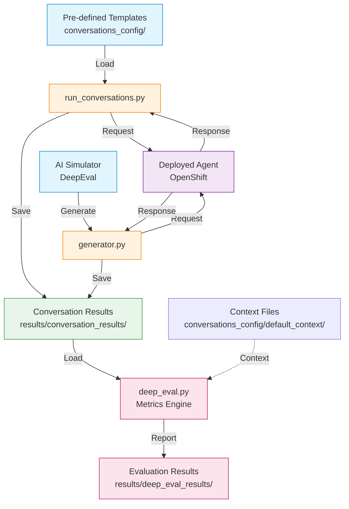

# Conversation Evaluation Guide

## 1. Overview

### 1.1 What is the Evaluation Framework?

Evaluations are important to be able to build and deploy agentic systems. Agentic systems are probabilistic, meaning that while each conversation may be unique for the same user input, multiple different responses can all be "correct". This makes testing and evaluation more difficult.

At the same time, sensitivity to change in agentic systems makes it vital that we can automatically validate behaviour after making changes to the system as small changes can easily introduce subtle issues that are difficult to manually identify. Traditional unit testing approaches are insufficient for these systems - they require evaluation frameworks that can assess quality and correctness across multiple valid outcomes.

This quickstart includes an evaluation framework built on top of [DeepEval](https://github.com/confident-ai/deepeval). This framework was a crucial tool in the development of the quickstart and provides an example of the kind of evaluation framework you will need as you build your agentic systems.

It allowed us to include validation as part of PR CI testing, compare performance of different models, evaluate changes to prompts and identify and address common conversation failures.

**Key Capabilities**

The framework provides three main capabilities:

1. **Live Agent Testing**: Execute predefined conversation flows against deployed agents in OpenShift, capturing real responses and interactions
2. **Synthetic Conversation Generation**: Use AI to generate realistic test conversations at scale, simulating diverse user behaviors and scenarios
3. **Comprehensive Metrics Evaluation**: Apply both standard conversational metrics and domain-specific business metrics to assess agent performance

**Three Types of Test Conversations**

The framework supports three distinct types of test conversations, each serving a different testing purpose:

- **Pre-defined conversations**: Hand-crafted test cases that validate critical user flows
- **Generated conversations**: AI-generated scenarios that provide broad test coverage
- **Known bad conversations**: Expected failure cases that validate the evaluation system itself

### 1.2 Architecture

The evaluation framework consists of four main components that work together in a coordinated pipeline:

**Four-Component Pipeline**

1. **`evaluate.py`** - Pipeline Orchestrator
   - Coordinates execution of all evaluation steps
   - Manages cleanup of previous test runs
   - Aggregates results and token usage statistics
   - Provides unified command-line interface
   - Handles error recovery and reporting

2. **`run_conversations.py`** - Live Agent Testing with Pre-defined Inputs
   - Executes pre-defined conversation templates against deployed agent
   - Uses hand-crafted user inputs from conversation templates
   - Connects to deployed agents via OpenShift
   - Captures real agent responses
   - Saves complete conversation transcripts
   - Tracks token usage from agent interactions

3. **`generator.py`** - Live Agent Testing with AI-Generated Inputs
   - Tests deployed agent with AI-generated user inputs
   - Simulates realistic user behaviors and diverse scenarios
   - Uses DeepEval's conversation simulator to generate user messages
   - Sends generated inputs to actual deployed agent
   - Captures real agent responses for each simulated user turn
   - Creates conversations with configurable length and complexity
   - Produces timestamped conversation files

4. **`deep_eval.py`** - Metrics-Based Evaluation
   - Applies comprehensive evaluation metrics to conversations
   - Uses LLM-based assessment for nuanced quality checks
   - Generates individual and aggregate evaluation reports
   - Provides detailed pass/fail analysis with scoring
   - Supports both standard and custom metrics

**How Components Work Together**

The typical evaluation workflow follows this sequence:

```
1. evaluate.py (Orchestrator)
   ↓
2. Cleanup Phase
   - Remove previous generated conversations
   - Clear old token usage files
   ↓
3. run_conversations.py
   - Execute pre-defined conversation templates
   - Save results to results/conversation_results/
   ↓
4. generator.py
   - Generate synthetic conversations
   - Add to results/conversation_results/
   ↓
5. deep_eval.py
   - Evaluate ALL conversations (pre-defined + generated)
   - Apply comprehensive metrics
   - Generate reports in results/deep_eval_results/
   ↓
6. Results Aggregation
   - Combine token usage statistics
   - Generate summary reports
   - Calculate overall pass rates
```

**Data Flow Diagram**



### 1.3 Prerequisites

Before using the evaluation framework, ensure you have the following prerequisites in place:

**Python 3.12+ Requirements**

The evaluation framework requires Python 3.12 or higher. It uses modern Python features and type hints that are not available in earlier versions.

```bash
# Check Python version
python --version  # Should show Python 3.12.x or higher

# Or with python3
python3 --version
```

**OpenShift CLI and Authentication**

The framework executes conversations against agents deployed in OpenShift. You'll need:

1. **OpenShift CLI (`oc`)**: Install the OpenShift command-line tool
   ```bash
   # Verify installation
   oc version
   ```

2. **Cluster Authentication**: Log in to your OpenShift cluster
   ```bash
   oc login --server=https://your-cluster:6443 --token=your-token
   ```

3. **Namespace Access**: Ensure you have access to the namespace where the agent is deployed
   ```bash
   # Verify access
   oc get pods -n your-namespace
   ```

**Deployed Self-Service Agent**

The evaluation framework requires a running instance of the self-service agent in OpenShift:

- Agent must be accessible via `oc exec` commands
- Agent should have the test script available (default: `chat.py`)
- Agent pods must be in Running state
- Agent should be able to process conversation requests

**LLM API Access**

The framework requires access to an LLM API for two purposes:

1. **Conversation Generation**: Simulating realistic user behavior (uses `generator.py`)
2. **Evaluation Metrics**: Assessing conversation quality with LLM-based metrics (uses `deep_eval.py`)

Supported API types:
- OpenAI-compatible endpoints

**Environment Variables Needed**

Configure the following environment variables before running evaluations:

**Required:**

```bash
# LLM API authentication token
export LLM_API_TOKEN="your-api-key-here"

# LLM API endpoint URL
export LLM_URL="https://your-llm-endpoint.com/v1"
```

**Optional:**

```bash
# Specific model ID to use (if not using endpoint default)
export LLM_ID="llama-3-3-70b-instruct"
```

**Verification:**

Verify your environment is properly configured:

```bash
# Check environment variables
echo $LLM_API_TOKEN  # Should show your API key
echo $LLM_URL        # Should show your endpoint URL

# Check OpenShift access
oc whoami           # Should show your username
oc project          # Should show current project/namespace

# Check Python version
python --version    # Should be 3.12 or higher
```

### 1.4 Types of Test Conversations

The evaluation framework supports three distinct types of test conversations, each serving a specific purpose in the testing strategy:

#### Pre-defined Conversations

**Location**: `conversations_config/conversations/`

Pre-defined conversations are hand-crafted test cases that validate critical user flows and scenarios. These conversations are version-controlled JSON files that represent important paths through your agent's functionality.

**Characteristics:**

- **Curated scenarios**: Carefully designed to test specific agent capabilities
- **Consistent baseline**: Same conversations run every time for regression testing
- **Version controlled**: Tracked in git for change management
- **Deterministic**: Produce repeatable results for comparison across runs
- **Human-verified**: Created by developers/QA who understand business requirements

**Example Structure:**

```json
{
    "metadata": {
        "authoritative_user_id": "alice.johnson@company.com",
        "description": "Successful laptop refresh flow"
    },
    "conversation": [
        {"role": "user", "content": "refresh"},
        {"role": "user", "content": "1001"},
        {"role": "user", "content": "I would like to see the options"},
        {"role": "user", "content": "3"},
        {"role": "user", "content": "proceed"}
    ]
}
```

**Special Subdirectory:**

- `conversations_config/conversations/no-employee-id/`: Alternative conversation templates for testing agents that don't require employee ID collection (uses authenticated user identity instead)

#### Generated Conversations

**Location**: Created in `results/conversation_results/` with prefix `generated_flow_`

Generated conversations are synthetic test cases created automatically by the `generator.py` script using DeepEval's conversation simulator. These conversations simulate realistic user behavior at scale.

**Characteristics:**

- **AI-generated**: Created using LLM to simulate realistic user responses
- **Scalable coverage**: Generate 10s or 100s of conversations in a single run
- **Realistic variation**: Different user behaviors, phrasings, and interaction patterns
- **Diverse scenarios**: Covers scenarios that manual testers might not think of
- **Timestamped**: Each generation creates unique files with timestamps

**How It Works:**

1. `generator.py` uses a DeepEval `ConversationSimulator`
2. Simulator uses an LLM to generate user messages based on scenario
3. Each user message is sent to the actual deployed agent
4. Agent responses are captured in the conversation
5. Process continues until conversation completes or max turns reached

**Example Generation:**

```bash
# Generate 20 conversations with up to 30 turns each
python generator.py 20 --max-turns 30

# Results in files like:
# - generated_flow_1_20251009_143521.json
# - generated_flow_2_20251009_143612.json
# - generated_flow_3_20251009_143705.json
```

**Customization:**

You can customize generated conversations by modifying:
- Scenario descriptions (what situation the user is in)
- User descriptions (employee ID, behavior characteristics)
- Maximum turns (conversation length)
- Random seed (for reproducible generation)

#### Known Bad Conversations

**Location**: `results/known_bad_conversation_results/`

Known bad conversations are test cases that are expected to fail evaluation metrics. These represent problematic agent behaviors that have been identified and documented.

**Characteristics:**

- **Regression test suite**: Ensures previously identified issues are detected
- **Expected failures**: Pass when metrics correctly identify problems

**Testing Known Bad Conversations:**

```bash
# Run evaluation on known bad conversations
python evaluate.py --check

# Expected behavior:
# - Evaluations run successfully
# - Metrics correctly identify failures
# - Exit code indicates problems were detected
```

**Exit Codes:**

- Exit code 0: Known bad conversations failed as expected (GOOD)
- Exit code 1: Known bad conversations passed unexpectedly (BAD - metrics aren't working)

**Creating Known Bad Conversations:**

When you find a problematic conversation:

1. Save the conversation file to `results/known_bad_conversation_results/`
2. Document what's wrong in the filename or metadata
3. Run `python evaluate.py --check` to verify metrics detect the issue
4. Use as regression test to prevent similar issues

**Example:**

```json
{
    "metadata": {
        "authoritative_user_id": "test.user@company.com",
        "description": "Agent returns wrong ticket format - should fail"
    },
    "conversation": [
        {"role": "user", "content": "I need a new laptop"},
        {"role": "assistant", "content": "I've created ticket INC0123456 for you"},
        {"role": "assistant", "content": "DONEDONEDONE"}
    ]
}
```

This conversation should fail the "Ticket number validation" metric because the ticket starts with "INC" instead of "REQ".

## 2. Quick Start

This section will guide you through installing the evaluation framework, configuring your environment, and running your first evaluation.

### 2.1 Installation

The evaluation framework uses **uv** for dependency management, which provides fast, reliable Python package installation and virtual environment management.

**Install with UV**

```bash
# Navigate to the evaluations directory
cd evaluations/

# Install dependencies using uv
# Note: uv automatically creates a .venv directory if it doesn't exist
uv sync
```

**What Gets Installed**

The `uv sync` command installs:

**Core dependencies:**
- `deepeval>=3.3.9` - Evaluation framework for conversational AI
- `openai>=1.99.0` - LLM API client library

**Verify Installation**

After installation, verify that everything is set up correctly:

```bash
# Activate the uv environment
source .venv/bin/activate  # On Linux/Mac
# or
.venv\Scripts\activate  # On Windows

# Check Python version
python --version  # Should be 3.12 or higher

# Verify deepeval is installed
python -c "import deepeval; print(deepeval.__version__)"

# Verify OpenAI client is installed
python -c "import openai; print(openai.__version__)"
```

### 2.2 Environment Configuration

Before running evaluations, you need to configure environment variables for LLM API access and verify your OpenShift connection.

**Required Environment Variables**

Set these environment variables in your shell:

```bash
# LLM API authentication token
export LLM_API_TOKEN="your-api-key-here"

# LLM API endpoint URL (OpenAI-compatible)
export LLM_URL="https://your-llm-endpoint.com/v1"
```

**Optional Environment Variables**

```bash
# Specific model ID to use (if not using endpoint default)
export LLM_ID="llama-3-3-70b-instruct"
```

**OpenShift Connection Setup**

The evaluation framework executes conversations against agents deployed in OpenShift. Ensure you have:

1. **OpenShift CLI installed**:
   ```bash
   # Verify oc is installed
   oc version
   ```

2. **Logged into your cluster**:
   ```bash
   # Log in to your OpenShift cluster
   oc login --server=https://your-cluster:6443 --token=your-token
   ```

3. **Access to the correct namespace**:
   ```bash
   # Switch to the namespace where your agent is deployed
   oc project your-namespace

   # Verify you can see the agent pods
   oc get pods | grep agent
   ```

**Verification Steps**

Run these commands to verify your environment is properly configured:

```bash
# 1. Check environment variables
echo $LLM_API_TOKEN  # Should display your API key
echo $LLM_URL        # Should display your endpoint URL

# 2. Check OpenShift access
oc whoami           # Should show your username
oc project          # Should show current namespace

# 3. Check Python and dependencies
python --version    # Should be 3.12 or higher
python -c "import deepeval, openai"  # Should run without errors

# 4. Verify agent pods are running
oc get pods         # Should show agent pods in Running state
```

### 2.3 Running Your First Evaluation

Once installation and configuration are complete, you're ready to run your first evaluation using the orchestrator script.

**Basic Pipeline Execution**

The `evaluate.py` script orchestrates the complete evaluation pipeline:

```bash
# Run the complete evaluation pipeline with default settings
# - Executes predefined conversation templates
# - Generates 20 additional synthetic conversations
# - Evaluates all conversations with comprehensive metrics
python evaluate.py
```

**Common Command-Line Options**

```bash
# Generate fewer conversations (faster for testing)
python evaluate.py -n 5

# Generate more conversations (broader coverage)
python evaluate.py --num-conversations 50

# Adjust maximum conversation turns
python evaluate.py --max-turns 30

# Use a different test script in OpenShift
python evaluate.py --test-script my_agent.py

# Skip employee ID collection checks
python evaluate.py --no-employee-id

# Test known bad conversations (validation check)
python evaluate.py --check
```

**Understanding the Output**

When you run the evaluation pipeline, you'll see output organized by steps:

```
🎯 Starting Evaluation Pipeline
================================================================================
📋 Step 1/3: Running predefined conversation flows...
🚀 Starting: python run_conversations.py --test-script chat.py
   [Output from conversation execution...]
✅ Completed: run_conversations.py (Duration: 45.32s)

📋 Step 2/3: Generating 20 additional test conversations...
🚀 Starting: python generator.py 20 --max-turns 20 --test-script chat.py
   [Output from conversation generation...]
✅ Completed: generator.py (Duration: 180.45s)

📋 Step 3/3: Running deepeval evaluation...
🚀 Starting: python deep_eval.py
   [Output from evaluation...]
✅ Completed: deep_eval.py (Duration: 95.12s)

🏁 Evaluation Pipeline Complete (Total Duration: 320.89s)
```

After evaluation completes, you'll see a comprehensive token usage summary:

```
=== COMPLETE PIPELINE TOKEN USAGE SUMMARY ===
================================================================================

📱 App Tokens (from chat agents):
  Input tokens: 45,230
  Output tokens: 12,890
  Total tokens: 58,120
  API calls: 156

🔬 Evaluation Tokens (from evaluation LLM calls):
  Input tokens: 89,450
  Output tokens: 8,340
  Total tokens: 97,790
  API calls: 234

📊 Combined Pipeline Statistics:
  Total LLM calls: 390
  Total tokens used: 155,910
```

**Where to Find Results**

The evaluation pipeline creates results in the `results/` directory:

```
results/
├── conversation_results/          # Conversation transcripts
│   ├── success-flow-1.json       # From predefined templates
│   ├── known_good_flow.json      # From predefined templates
│   ├── generated_flow_1_*.json   # AI-generated conversations
│   ├── generated_flow_2_*.json
│   └── ...
├── deep_eval_results/            # Evaluation reports
│   ├── deepeval_success-flow-1.json        # Individual results
│   ├── deepeval_generated_flow_1_*.json
│   ├── deepeval_all_results.json           # Combined results
│   └── ...
└── token_usage/                  # Token usage statistics
    ├── run_conversations_*.json
    ├── generator_*.json
    ├── deep_eval_*.json
    └── pipeline_aggregated_*.json  # Combined token stats
```

**Examining Results**

1. **Conversation transcripts** (`results/conversation_results/`):
   - View actual conversations between users and the agent
   - See user inputs and agent responses
   - Check metadata like user IDs and timestamps

2. **Evaluation reports** (`results/deep_eval_results/`):
   - Individual JSON files show metric-by-metric evaluation
   - `deepeval_all_results.json` provides aggregated pass/fail statistics
   - Each metric includes score, success status, and reason

3. **Token usage** (`results/token_usage/`):
   - Track LLM API usage for cost estimation
   - Separate app tokens (agent) from evaluation tokens
   - Identify expensive conversations or metrics

**Example: Viewing Evaluation Results**

```bash
# View the combined evaluation results
cat results/deep_eval_results/deepeval_all_results.json | jq .

# Count successful evaluations
cat results/deep_eval_results/deepeval_all_results.json | jq '.successful_evaluations | length'

# View a specific conversation result
cat results/conversation_results/success-flow-1.json | jq .

# Check token usage summary
cat results/token_usage/pipeline_aggregated_*.json | jq '.summary'
```
